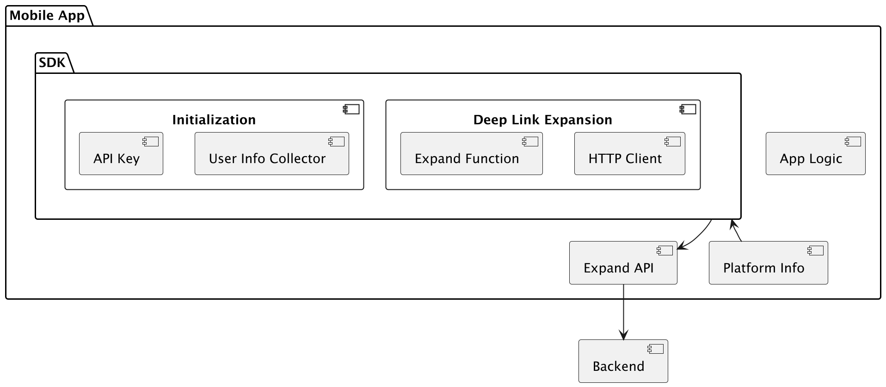

### Architecture Overview

**The SDK will have two key functional components:**
1.	Initialization Module: Gathers user and platform information during SDK setup and prepares the environment for API communication.
2.	Deep Link Expansion Module: Handles the expand API call to retrieve metadata for a given path.

**Here's a high-level flow:**

1.	SDK Initialization
    * Initialize with an API key.
    *	Collect platform and user details (e.g., OS version, SDK version, etc.).
    *	Send collected data to a backend endpoint if required for analytics.
2.	Deep Link Expansion
    *	Accept a deep link path from the application.
    *	Make an HTTP request to the /expand API endpoint to retrieve associated metadata.
    *	Parse the JSON response into a Metadata object.
    *	Return the Metadata object to the caller or handle errors as needed.

